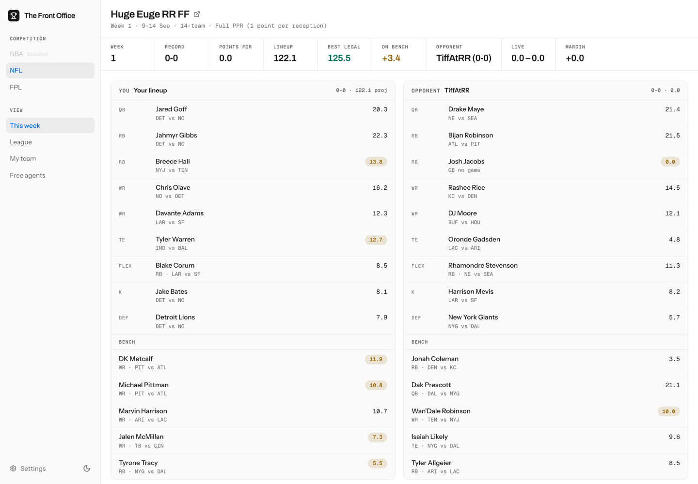
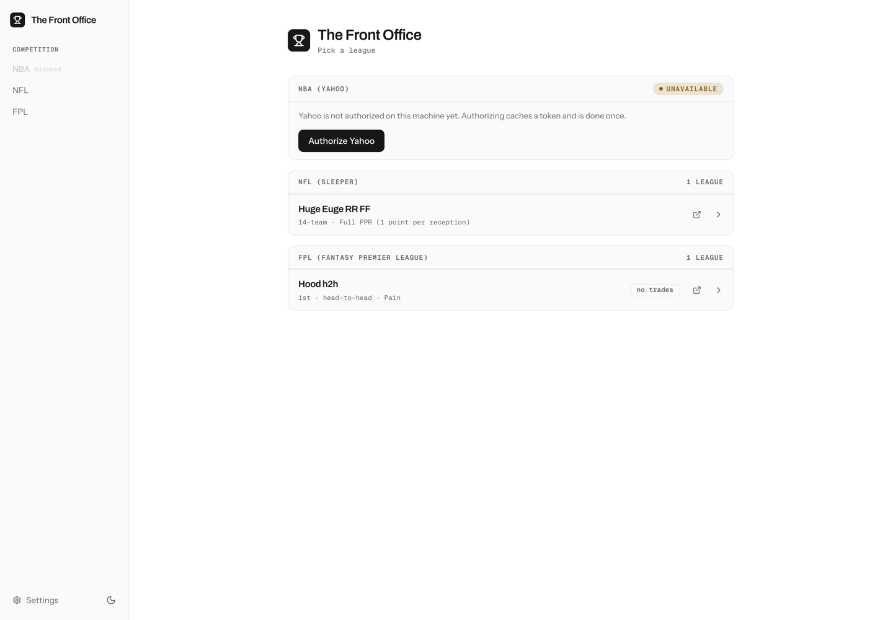
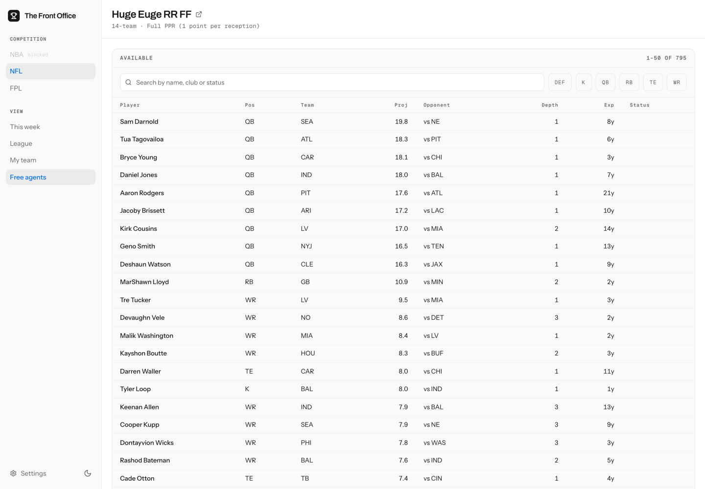
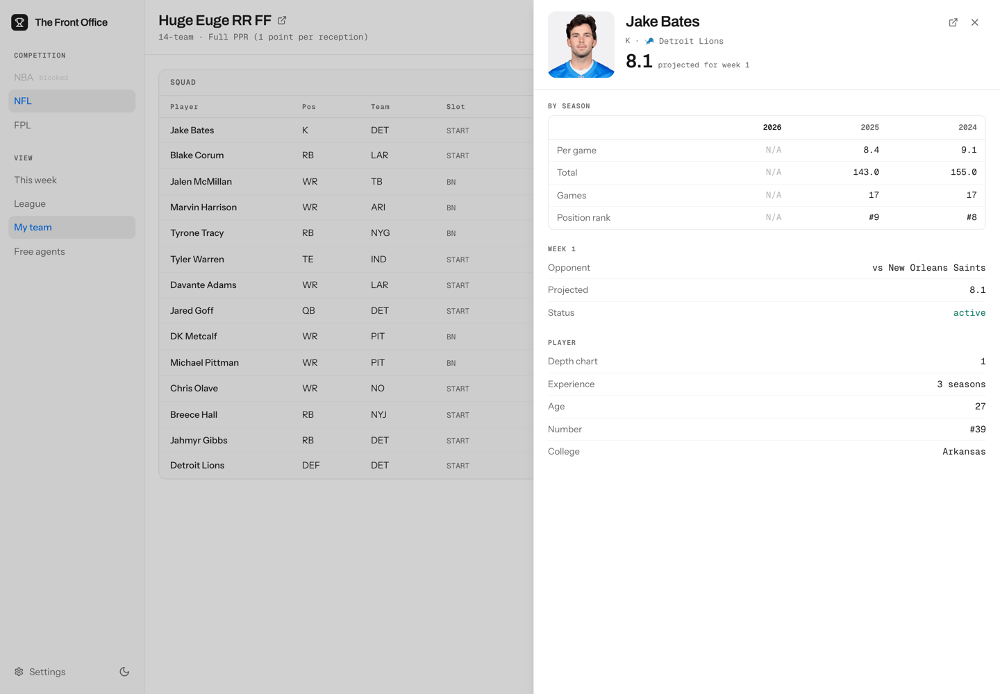
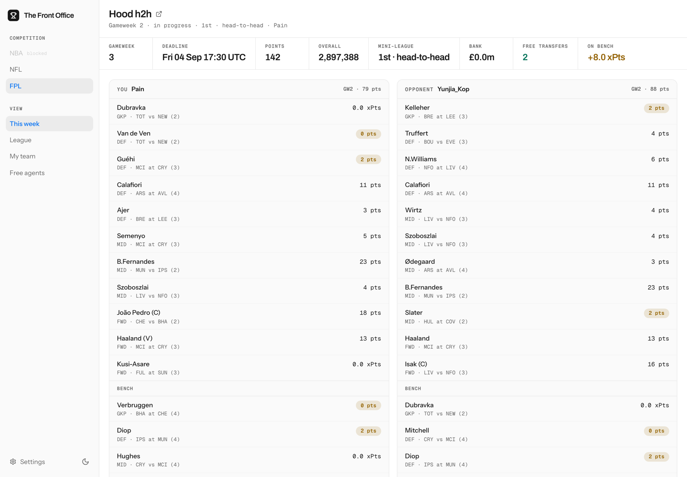

# The Front Office

[](https://github.com/abhishekbabu/thefrontoffice/actions/workflows/ci.yml)

An AI general manager for your fantasy teams. It reads your live league state,
real stats and the fixtures ahead, then scouts the waiver wire, checks your
lineup, evaluates trades and answers follow-up questions about any of it.

Three competitions, each on the platform that runs it:

| Competition | Platform | Credentials |
|---|---|---|
| NBA | Yahoo Fantasy | OAuth (one browser login) |
| NFL | Sleeper | Username only |
| Premier League | Fantasy Premier League | Entry id only |



## Quick start

**1. Install the two CLIs.** Python is not installed separately — `uv` provisions
an interpreter matching `requires-python`.

```bash
brew bundle                                            # macOS / Linux
winget install --id=astral-sh.uv --id=Casey.Just -e     # Windows
```

**2. Install the project.**

```bash
just install                 # uv sync + git hooks
cp .env.template .env        # PowerShell: Copy-Item .env.template .env
```

**3. Add credentials.** Either edit `.env`, or start the app and use its
**Settings** page, which writes `.env` for you and re-reads it into the running
process — no restart. Secrets there are write-only: the server reports whether
one is set, never what it is.

- **NFL** — your Sleeper username.
- **Premier League** — your entry id, the number in the URL of your own points
  page: `fantasy.premierleague.com/entry/<THIS>/event/1`.
- **NBA** — a [Yahoo developer app](https://developer.yahoo.com/apps/) with
  Fantasy Sports **Read** permission and redirect URI `https://localhost:8080`,
  then `just yahoo-login` (see [Yahoo access](#yahoo-access)).
- **Analysis** — a [Gemini API key](https://aistudio.google.com/app/apikey).
  Optional; without it the app offers no analysis rather than offering and
  refusing it.

**4. Run it.**

```bash
just ui     # build the UI and serve it at http://localhost:8000
just run    # interactive CLI instead
```

`just doctor` reports what this machine is configured for, without echoing a
secret, and flags `.env` keys nothing will read.



## What it does

The app opens on a league picker and every view has its own address, so a page
can be linked, bookmarked or reloaded and Back means what it says.

| Path | Page |
|---|---|
| `/` | every league you can play |
| `/{competition}-{platform}/{league}` | this week, the default view |
| `/{competition}-{platform}/{league}/{view}` | `league`, `team`, `free-agents`, `report`, `trade` |
| `/settings` | credentials and appearance |

A competition with no league (`/nfl-sleeper`) resolves to your first one, and a
path naming a competition you cannot play returns to `/`.

**This week** — your matchup: both lineups side by side, the fixtures behind
them, and the swaps the projections already imply. All read or computed from
league state, so it is complete before a model is asked anything.



**Free agents** — everyone available, ranked by projection, searchable and
filterable by position. **League** covers the season: your results so far, the
table, every roster, the fixture list and the transaction feed. **My team** is
your squad in more depth, and any row opens a player.



**Report** and **Trade** are the model's work: a scouted week with adds, drops
and lineup changes, and a plain-language trade verdict
(`Give Bijan, Get Puka`). Both drop into a follow-up chat. They appear only
when `GOOGLE_API_KEY` is set — commands and views that cannot work are hidden
rather than disabled.

The same three competitions run in the CLI:

| Command | Description |
|---|---|
| `/leagues` | Every league you are in, per competition |
| `/roster [competition]` | Your squad |
| `/scout [competition]` | Analyze a week. No competition runs every configured one |
| `/trade [competition] <text>` | Evaluate a trade. FPL is excluded — its managers transfer against the market rather than trading each other |
| `/help` · `/quit` | — |



## Configuration

Every variable is a validated field on `AppSettings` in
[`config/settings.py`](src/thefrontoffice/config/settings.py); a malformed value
fails at startup naming the field, not mid-report.

| Variable | Required | Default | Notes |
|---|---|---|---|
| `SLEEPER_USERNAME` | for NFL | — | Sleeper needs no key or OAuth |
| `FPL_ENTRY_ID` | for FPL | — | FPL has no username lookup |
| `YAHOO_CLIENT_ID` | for NBA | — | From your Yahoo developer app |
| `YAHOO_CLIENT_SECRET` | for NBA | — | From your Yahoo developer app |
| `YAHOO_REDIRECT_URI` | no | `https://localhost:8080` | Must match the app's registered URI |
| `YAHOO_MAX_WEEKLY_ADDS` | no | `3` | Integer ≥ 0; the scout's add budget |
| `GOOGLE_API_KEY` | no | — | Omit and the app offers no analysis |
| `LOGFIRE_TOKEN` | no | — | Write token from a [Logfire](https://logfire.pydantic.dev) project. Omit and nothing is exported |
| `LOGFIRE_ENVIRONMENT` | no | `local` | Separates traces from a laptop and a deployed run |
| `LOGFIRE_CAPTURE_PROMPTS` | no | `false` | Sends prompt and completion **text**. Off deliberately — a prompt carries your roster and leagues |
| `LOG_LEVEL` | no | `INFO` | `DEBUG` \| `INFO` \| `WARNING` \| `ERROR` \| `CRITICAL` |

`YAHOO_CACHE_DIR`, `SLEEPER_CACHE_DIR` and `FPL_CACHE_DIR` relocate the
per-platform response caches; the defaults are `.yahoo_cache`, `.sleeper_cache`
and `.fpl_cache`.

**On a second machine**, copy `.env` across by hand — the four secrets belong in
a password manager, not in this public repo — then run `just doctor`. Do not
copy `.yahoofantasy`: refresh-token rotation means two machines sharing one
token invalidate each other, and re-authorizing is a single browser flow. The
caches are derived and expiring; leave them behind too.

## Yahoo access

```bash
just yahoo-login    # opens a browser; token cached in .yahoofantasy and reused
```

It is a separate step because the handshake blocks on a browser click, which a
request handler cannot do — so every non-interactive path reports a missing
token rather than trying to obtain one. The browser will warn about the
self-signed localhost certificate; that is expected, and Yahoo only accepts an
`https` redirect.

Two things beyond the login are easy to miss, and both fail the same way — every
Fantasy endpoint answers **403**, including ones needing no user permission,
which is how this is told apart from an invalid token (401):

- **Yahoo reviews every application** before granting Fantasy Sports API access.
  Apply at [sports.yahoo.com/developer/access](https://sports.yahoo.com/developer/access/);
  personal single-league use is an accepted category.
- **API Permissions → Fantasy Sports → Read must be saved** *before* you
  authorize. Yahoo fixes a token's grant at that moment, and a refresh cannot
  widen it, so the fix is `just yahoo-login --force`. The login verifies itself
  rather than reporting success on an inert token.

## Architecture

Ports and adapters, dependencies pointing strictly inward:

```text
src/thefrontoffice/
├── domain/            models and ports. Imports nothing else in the package.
├── application/       use cases over ports: ScoutEngine, TradeEngine.
├── adapters/
│   ├── inbound/       drivers: the CLI and the FastAPI + React web app.
│   └── outbound/      driven: platform clients, the model, and the
│                      per-competition CompetitionProvider implementations.
├── bootstrap.py       composition root: the only module naming a concrete
│                      implementation. Registers competitions, wires engines.
└── config/            validated settings, prompt templates, telemetry.
```

No adapter is named in `domain/` or `application/`; the engines take an
`AnalysisModel` port rather than a vendor client. Adding a competition is a
provider, a prompt template and one `CompetitionEntry` — see the
[`adding-a-competition`](.agents/skills/adding-a-competition/SKILL.md) skill.

**API** — FastAPI returns the domain models directly: `ScoutReport` *is* a
route's response schema, so there is no second representation to keep in step.
It also serves the built UI from `web/dist`, so one process on one port covers
both.

**Platforms** — Yahoo via `yahoofantasy` (OAuth2, rosters, matchups, free agents
sorted by stat category); Sleeper, public and auth-free, which is also the stats
provider for both football and basketball (projections, box scores, schedules,
transactions); Fantasy Premier League, public and auth-free, whose one
`bootstrap-static` call carries the squad, prices, the game's own `ep_next`
projection and Opta expected goals. Each caches responses in its own directory.

**Model** — Gemini via `google-genai`: `gemini-2.5-pro` for analysis,
`gemini-2.5-flash` for parsing. Reports come back as Pydantic models through a
response schema, never as prose to be parsed out.

**Web UI** (`web/`) — React 19, Vite, Tailwind v4, Radix primitives, Motion
loaded lazily to hold the entry bundle under 150 kB gzip. Shared pieces live in
`components/ui/`; `panels/` holds one page each. Color is themed in two
orthogonal dimensions — a palette (`data-theme`) and light/dark
(`color-scheme`) — so every token is a single `light-dark(light, dark)`
declaration and no component branches on either.

**Tracing** — OpenTelemetry via `logfire`, configured in
[`config/telemetry.py`](src/thefrontoffice/config/telemetry.py) and nowhere
else. The libraries carrying the latency are auto-instrumented, so no span is
opened by hand and `domain/` and `application/` never learn telemetry exists.
Without `LOGFIRE_TOKEN` nothing is exported and no network call is made.

## Development

```bash
just doctor             # what this machine is configured for
just check              # lint + format + types + tests + 95% coverage floor
just check-web          # lint + typecheck + tests + bundle budget (UI)
just fmt                # auto-fix lint findings, then format
just test               # hermetic suite (args pass through: just test "-k scout")
just lock               # re-resolve uv.lock after editing pyproject.toml
just clean              # caches and build artefacts
just clean-data         # only the platform caches, forcing a refetch
```

`just --list` for the full catalog.

For UI work, run the two halves separately so the front end hot-reloads:

```bash
just api    # FastAPI on :8000, reloading on change
just web    # Vite on :5173, proxying /api to the above
```

To look at the finished thing:

```bash
just preview   # the real app on its own port, so `just ui` keeps :8000
just shots     # screenshot every view into web/.shots (starts its own preview)
```

Both run the same routes against the same platforms as `just ui` — real data is
where the awkward cases are. `shots` drives it with Playwright and reports any
console errors, which a screenshot of a blank panel otherwise hides.

Tests are hermetic: no network, no credentials, no cache on disk. Engines take
their collaborators by keyword, so the `tests/conftest.py` fakes stand in for
the platforms and the model. Anything hitting a live API is marked
`@pytest.mark.integration` and deselected by default. New code needs tests in
the same commit; coverage is gated at 95%.

CI runs these same `just` recipes on Linux, macOS and Windows, on the Python
version `.python-version` pins plus one newer leg, with `uv sync --locked` and
`pnpm install --frozen-lockfile`. If `just check` and `just check-web` pass
locally they pass in CI.

Agent-facing rules are in [`AGENTS.md`](AGENTS.md), with shared skills under
[`.agents/skills/`](.agents/skills/). `CLAUDE.md` beside any `AGENTS.md` is a
symlink to it, and `.claude/skills` and `.agent/rules/rules.md` are symlinks
too — one source of truth per tool. `just check-agents` enforces that.

## Security

Never commit `.env`, `.yahoofantasy`, or any `.*_cache/` — all are gitignored,
and `detect-private-key` runs as a pre-commit hook. Credentials are read only
through the `settings` singleton, never `os.getenv` at a call site, and a
secret's value never leaves the process.
